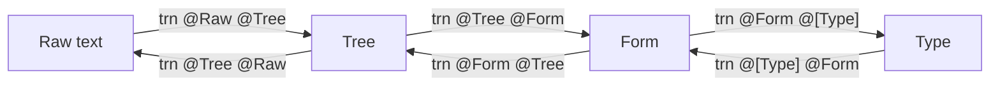

## data-cmd
Parser and renderer for any(generic) type. Suitable for command line, textual represenation of the type

### Development

Enter nix shell with hls using
```
nix-shell --arg withHLS true
```

### Utility

Simple parsing pipeline for textual representation of Haskell types. Suitable for single line description of some "action" type

### Usage and examples

```
data Dir = Dir Int Int
 deriving (Generic, Show, Eq)

data Act
 = NoAct
 | MoveDir { moveDir  :: Dir }
 | MoveX { moveX :: Int }
 | Spawn { spawnLoc :: (Int, Int), spawnName :: String  }
 deriving (Generic, Show, Eq)
```

`Act` type represents an action applicable to some world/board.
These actions can quickly be executed through repl that parses raw input into a `Act` type.


Repl input of MoveDir action with its (and its subtypes') parameters in a "n-dot separated syntax":

```
movedir . dir .. 1 .. 2
```
will result in this `Act`:
```
MoveDir { moveDir = Dir 1 2 }
```

and so will this input  (bracket separated syntax)
```
movedir (dir 1 2)
```
but it uses different Raw --> Tree (Lexer) transformation (explained in next section)

### How it works

Parsing pipeline consists of 3 levels of monadic transformations between types. This is captured with `HasTrans` instance and specifically `trn :: a -> Res b` function.

The 3 stages are:
* `Raw --> Tree`

  Transform raw string into Tree structure. This is like extracting lexical token, but a tree of tokens instead of a list

  `movedir . dir .. 1 .. 2` --> `ND [LF "movedir", ND [LF "dir", LF "1", LF "2"]]`

* `Tree --> Form`

  Second stage forms the token tree into a type Form by separating constructors and subtypes forms

  `ND [LF "movedir", ND [LF "dir", LF "1", LF "2"]]` --> `"movedir" :.. [ "dir" :.. [FPrim "1", FPrim "2"]]

* `Form --> Type`

  Third stage reads the Form into a generic representation of a type

  `"movedir" :.. [ "dir" :.. [FPrim "1", FPrim "2"]] --> `MoveDir { moveDir = Dir 1 2 }`

Each stage implements their `trn` function.

In example above both `movedir . dir .. 1 .. 2` and `movedir (dir 1 2)` get transformed into same `Tree` by different stage0 (lexer) transformation
Extracted tree captures constructors and parameters in `Form` type, which then gets converted into resulting Type (`Act`).

Each transformation wraps the result (or lack of it) in `Res` type (`Res a = Maybe a * Log`).
Log itself is a tree structure that builds up nicelly in and between stages resulting is a tree collection of messages regaring stages of parsing.
Log gives an informative message in case of parsing failure in any stage.


`
