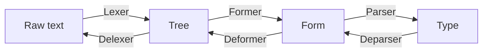

## data-cmd
Parser and renderer for any(generic) type. Suitable for command line, textual represenation of the type

### Development

Enter nix shell with hls using
```
nix-shell --arg withHLS true
```

### Utility


### Usage

### Examples

### How it works


